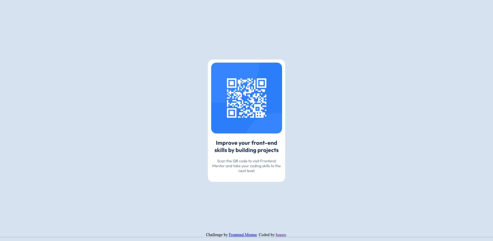

# Frontend Mentor - QR code component solution

This is a solution to the [QR code component challenge on Frontend Mentor](https://www.frontendmentor.io/challenges/qr-code-component-iux_sIO_H). Frontend Mentor challenges help you improve your coding skills by building realistic projects.

## Table of contents

- [Overview](#overview)
  - [Screenshot](#screenshot)
  - [Links](#links)
- [My process](#my-process)
  - [Built with](#built-with)
  - [What I learned](#what-i-learned)
  - [Continued development](#continued-development)
  - [Useful resources](#useful-resources)
- [Author](#author)
- [Acknowledgments](#acknowledgments)

## Overview

### Screenshot




### Links

- Live Site URL: [Github.io page](https://bongo418.github.io/qr-code/)

## My process

### Built with

- HTML5
- CSS
- Flexbox
- CSS Grid (Not 100% sure about this one. I just used Flexbox properties)

### What I learned

Don't try and rush it. Experiment and use the MDN docs.
If I'm trying to center elements as a whole with Flexbox, I need to add a parent and use justify-content/align-items with that, otherwise I'm centering the elements inside the container and not the container itself.

```css
.attribution {
  text-align: center;
  font-size: 15px;
  font-weight: 400;
  color: #68778d;
  position: absolute;
  bottom: 10px;
  left: 50%;
  transform: translateX(-50%);
  width: 100%;
}
```

### Continued development

CSS is still not my favourite.

### Useful resources

- [MDN Web Docs](https://developer.mozilla.org/en-US/) - I can't explain how useful this has been for CSS
- [Microsoft Copilot](https://copilot.microsoft.com/) - Helped me with some of my footer code when it was stuck to the side of my QR code and not the bottom.

## Author

- Github - [bongo418](https://github.com/bongo418)
- Frontend Mentor - [@bongo418](https://www.frontendmentor.io/profile/bongo418)

## Acknowledgments

Thanks to Colt Steele and his "The Web Developer Bootcamp 2025" course on Udemy.
