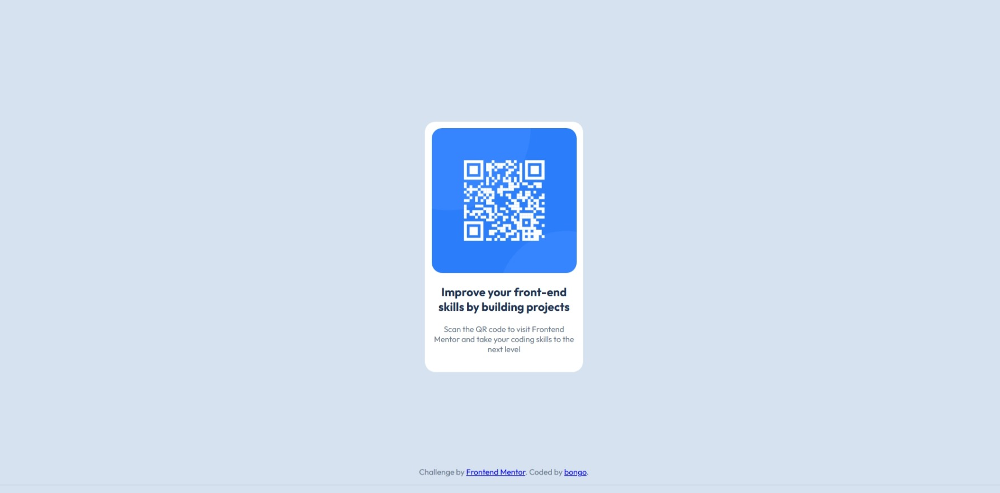

# Frontend Mentor - QR code component solution

This is a solution to the [QR code component challenge on Frontend Mentor](https://www.frontendmentor.io/challenges/qr-code-component-iux_sIO_H). Frontend Mentor challenges help you improve your coding skills by building realistic projects.

## Table of contents

- [Overview](#overview)
  - [Screenshot](#screenshot)
- [My process](#my-process)
  - [Built with](#built-with)
  - [What I learned](#what-i-learned)
  - [Continued development](#continued-development)
  - [Useful resources](#useful-resources)
- [Author](#author)
- [Acknowledgments](#acknowledgments)

## Overview

### Screenshot



## My process

### Built with

- Semantic HTML5 markup
- CSS custom properties
- Flexbox
- CSS Grid (Not 100% sure about this one. I just used Flexbox properties)

### What I learned

I learned about position: absolute; and bottom: 0; It made my footer change from being stuck to the right of my content, to being at the bottom like I intended.

```css
footer {
  text-align: center;
  position: absolute;
  bottom: 0;
  width: 100%;
  text-align: center;
}
```

### Continued development

CSS is still a pain. The <main> and <section> was probably not needed and made things a lot more difficult for this. I like them, though; I just need to improve my CSS a lot more.

### Useful resources

- [Quillbot Grammar Check](https://quillbot.com/grammar-check) - Helped with some grammar in the README.
- [Microsoft CoPilot](https://copilot.microsoft.com/) - Helped me with some of my footer code when it was stuck to the side of my QR code and not the bottom.

## Author

- Github - [bongo418](https://github.com/bongo418)
- Frontend Mentor - [@bongo418](https://www.frontendmentor.io/profile/bongo418)

## Acknowledgments

Thanks to Colt Steele and his "The Web Developer Bootcamp 2025" course on Udemy.
